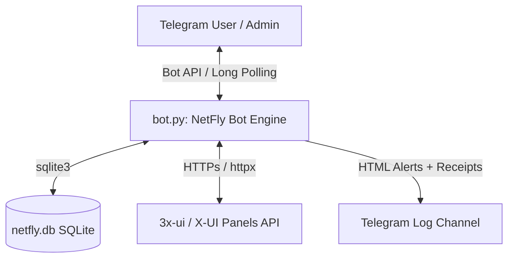
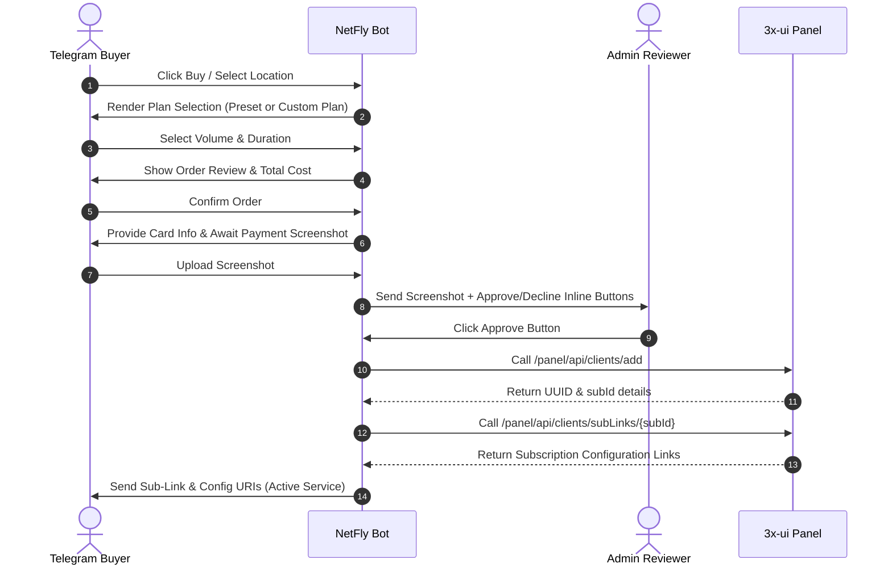

# NetFly — Advanced Telegram VPN Subscription & X-UI Panel Manager

**NetFly** is a feature-rich, high-performance, and fully localized (Persian/فارسی) Telegram bot designed for selling, automated provisioning, and managing VPN access. Built with a modern asynchronous stack ([aiogram 3.x](file:///c:/Users/Litebeet/Desktop/Netfly/requirements.txt#L1) and [httpx](file:///c:/Users/Litebeet/Desktop/Netfly/requirements.txt#L3)), it integrates directly with **X-UI / 3x-ui** panels to provide seamless sub-link distribution, live usage statistics, and direct administrative controls via Telegram's latest inline features.

---

## 🗺️ Project Architecture & Data Flow

The diagram below illustrates how the Telegram client interacts with the bot engine, which manages the SQLite persistence layer, handles network requests to the 3x-ui panels, and streams audit records to the log channel.



---

## 📂 Codebase Directory Layout

The core logic is structured modularly:

*   **[bot.py](file:///c:/Users/Litebeet/Desktop/Netfly/bot.py)**: The primary entry point. Initializes logging, loads settings, opens the SQLite database, registers middlewares, loads handlers, and starts polling.
*   **[app/](file:///c:/Users/Litebeet/Desktop/Netfly/app)**
    *   **[config.py](file:///c:/Users/Litebeet/Desktop/Netfly/app/config.py)**: Environment variable parsing using `dotenv`. Sets up [Settings](file:///c:/Users/Litebeet/Desktop/Netfly/app/config.py#L40).
    *   **[db.py](file:///c:/Users/Litebeet/Desktop/Netfly/app/db.py)**: Database wrapper class [Database](file:///c:/Users/Litebeet/Desktop/Netfly/app/db.py#L217) representing the storage layer, containing schema migrations and database transactions.
    *   **[xui.py](file:///c:/Users/Litebeet/Desktop/Netfly/app/xui.py)**: A comprehensive asynchronous client wrapper ([XuiClient](file:///c:/Users/Litebeet/Desktop/Netfly/app/xui.py#L280)) interacting with X-UI panel endpoints.
    *   **[channel_gate.py](file:///c:/Users/Litebeet/Desktop/Netfly/app/channel_gate.py)**: Logic for gating bot access behind mandatory join criteria for an announcement channel.
    *   **[pricing.py](file:///c:/Users/Litebeet/Desktop/Netfly/app/pricing.py)**: Promotional calculations and price formatting utilities.
    *   **[logs.py](file:///c:/Users/Litebeet/Desktop/Netfly/app/logs.py)**: The structured event audit engine ([NetFlyLogger](file:///c:/Users/Litebeet/Desktop/Netfly/app/logs.py#L166)) that formats and forwards logs to the admin's Telegram log channel.
    *   **[role_permissions.py](file:///c:/Users/Litebeet/Desktop/Netfly/app/role_permissions.py)** & **[admin_perms.py](file:///c:/Users/Litebeet/Desktop/Netfly/app/admin_perms.py)**: Built-in and database-configurable authorization matrix for administrators and staff.
    *   **[texts.py](file:///c:/Users/Litebeet/Desktop/Netfly/app/texts.py)** & **[keyboards.py](file:///c:/Users/Litebeet/Desktop/Netfly/app/keyboards.py)**: Localization copy (Persian) and modular Telegram keyboard templates.
    *   **[middlewares.py](file:///c:/Users/Litebeet/Desktop/Netfly/app/middlewares.py)**: Custom handlers intercepting Telegram events, such as `UserMiddleware` (auto-registration and registration updates) and `ChannelJoinMiddleware` (enforcing channel membership).
    *   **[handlers/](file:///c:/Users/Litebeet/Desktop/Netfly/app/handlers/)**: Handles incoming callback queries, commands, and text messages.
        *   **[start.py](file:///c:/Users/Litebeet/Desktop/Netfly/app/handlers/start.py)**: Directs users to the buyer menu and authorized admins to the admin console.
        *   **[order.py](file:///c:/Users/Litebeet/Desktop/Netfly/app/handlers/order.py)**: User-facing step-by-step order booking wizard (Location ➡️ Volume ➡️ Duration ➡️ Receipt).
        *   **[review.py](file:///c:/Users/Litebeet/Desktop/Netfly/app/handlers/review.py)**: Admin order approval queues, decline handlers, and panel provisioning actions.
        *   **[my_services.py](file:///c:/Users/Litebeet/Desktop/Netfly/app/handlers/my_services.py)**: The subscriber control panel (subscription details, refreshing traffic, renaming/regenerating configs, renewing services).
        *   **[test_sub.py](file:///c:/Users/Litebeet/Desktop/Netfly/app/handlers/test_sub.py)**: Handles instant one-time trial subscription requests.
        *   **[support.py](file:///c:/Users/Litebeet/Desktop/Netfly/app/handlers/support.py)**: Handles user help tickets and allows admins to reply directly to users.
        *   **[admin_panel.py](file:///c:/Users/Litebeet/Desktop/Netfly/app/handlers/admin_panel.py)**: Consolidated inline routing and page rendering for administrative services.

---

## 🗄️ Database Model (SQLite Schema)

The persistent database layer (`netfly.db`) uses **SQLite** with strict foreign keys enabled. It consists of the following key tables:

### 1. `users`
Tracks Telegram users who have interacted with the bot.
*   `user_id` (INTEGER, Primary Key): Telegram ID.
*   `username`, `first_name`, `last_name`, `lang_code` (TEXT): Telegram profile details.
*   `created_at` (TEXT): Creation timestamp.
*   `is_banned` (INTEGER): Banning flag (0 or 1).

### 2. `settings`
Key-value storage for parameters modified during runtime (pricing defaults, trial options, channel gate details, admin roles).
*   `key` (TEXT, Primary Key)
*   `value` (TEXT)

### 3. `locations`
Represents the servers (panels) connected to the bot.
*   `id` (INTEGER, Primary Key AUTOINCREMENT)
*   `name` (TEXT): Display name for the server.
*   `base_url` (TEXT): The URL of the X-UI panel (e.g. `https://my-panel.com:2096`).
*   `api_token` (TEXT): The Bearer authentication token.
*   `inbound_ids` (TEXT): JSON array of integer inbound IDs mapped to this location.
*   `sub_url_template` (TEXT): Subscription URL format (e.g. `https://host:2096/sub/{subId}`).
*   `price_base`, `price_per_gb`, `price_per_day` (INTEGER): Custom override pricing for this specific location.
*   `enabled` (INTEGER): Toggle to enable/disable the location.
*   `purchase_enabled` (INTEGER): Toggle to enable/disable new purchases on this location.
*   `is_test` (INTEGER): Designates the location for free trial accounts.
*   `config_buttons` (TEXT): JSON array configurations for custom geographic filter keyboards.

### 4. `orders`
Stores VPN subscription orders, active services, trials, and payment statuses.
*   `id` (INTEGER, Primary Key AUTOINCREMENT)
*   `user_id` (INTEGER): FK references `users`.
*   `location_id` (INTEGER): FK references `locations`.
*   `location_name` (TEXT): Snapshot of the location name.
*   `volume_gb`, `duration_days`, `price` (INTEGER): Order constraints and price.
*   `status` (TEXT): State machine values (`awaiting_payment`, `awaiting_review`, `approved`, `declined`, `provisioned`, `failed`, `completed_renewal`).
*   `screenshot_file_id` (TEXT): Telegram File ID of the payment receipt photo.
*   `admin_id` (INTEGER): Telegram ID of the reviewing admin.
*   `decline_reason` (TEXT): Reason entered if an admin declines the purchase.
*   `xui_email` (TEXT): The client identifier on the panel (e.g. `nf101` or `nf101r1`).
*   `xui_sub_id` (TEXT): The panel subscription ID.
*   `xui_client_uuid` (TEXT): The unique UUID assigned on the panel.
*   `sub_links` (TEXT): JSON list of raw config links.
*   `nickname` (TEXT): Custom alias chosen by the user.
*   `is_test` (INTEGER): trial subscription flag.
*   `renew_of_order_id` (INTEGER): Self-referencing FK linking renewals back to the original order ID.

### 5. `tickets`
Tracks client-support communications.
*   `id` (INTEGER, Primary Key AUTOINCREMENT)
*   `user_id` (INTEGER): FK references `users`.
*   `message` (TEXT): Ticket content.
*   `status` (TEXT): Ticket status (`open`, `closed`).
*   `created_at` (TEXT)

### 6. `service_packages`
Pre-defined subscription packages per location when dynamic custom plan builders are disabled.
*   `id` (INTEGER, Primary Key AUTOINCREMENT)
*   `location_id` (INTEGER): FK references `locations`.
*   `volume_gb`, `duration_days`, `price` (INTEGER)
*   `enabled` (INTEGER)

---

## 👥 Administrative Roles & Permission Matrix

To support staff hierarchies (e.g., manager, reviewer, support), NetFly includes a modular permission gate. The owner (defined as the first ID in the `.env` `ADMIN_IDS` array) automatically possesses all privileges. Other staff are assigned roles stored in the `settings` database table.

Permissions can be dynamically edited by the owner to override defaults. Below is the default authorization matrix:

| Permission Key | Description | Owner | Manager | Reviewer | Support | Viewer |
| :--- | :--- | :---: | :---: | :---: | :---: | :---: |
| `panel` | Access the admin command console `/admin` | ✅ | ✅ | ✅ | ✅ | ✅ |
| `dashboard` | View metrics, sales summary, and charts | ✅ | ✅ | ✅ | ✅ | ✅ |
| `orders_review` | Accept/decline payment receipts in channels | ✅ | ✅ | ✅ | ✅ | ❌ |
| `orders_manage` | Lookup, rename, edit, delete active services | ✅ | ✅ | ✅ | ❌ | ❌ |
| `users` | View Telegram user profiles and block/unblock users | ✅ | ✅ | ❌ | ✅ | ✅ |
| `customers` | Analyze customer details and order logs | ✅ | ✅ | ✅ | ✅ | ✅ |
| `settings` | Edit card numbers, pricing rules, toggle trials | ✅ | ✅ | ❌ | ❌ | ❌ |
| `services` | Configure preset packages and custom plan modes | ✅ | ✅ | ❌ | ❌ | ❌ |
| `offer` | Toggle global percentage or amount discount campaigns | ✅ | ✅ | ❌ | ❌ | ❌ |
| `locations` | Add, delete, edit inbounds, and toggle locations | ✅ | ✅ | ❌ | ❌ | ❌ |
| `tools_broadcast`| Send broadcast messages to all registered users | ✅ | ✅ | ❌ | ❌ | ❌ |
| `tools_sync` | Sync and cleanup inactive users with panels | ✅ | ✅ | ❌ | ❌ | ❌ |
| `tools_misc` | Purge database logs and manage system health | ✅ | ✅ | ❌ | ❌ | ❌ |
| `manage_admins` | Grant or revoke roles for other admin staff | ✅ | ❌ | ❌ | ❌ | ❌ |

---

## 🔄 Core Workflows Explained

### 1. Purchase & Provisioning Flow



1.  **Selection**: The user selects a location. If the system is in **package mode**, they choose a predefined package. If in **legacy/custom mode**, they select or input a custom traffic volume (GB) and duration (days).
2.  **Review & Billing**: The bot displays a summary showing the selected location, traffic volume, duration, and calculated price. If the user confirms, an order is initialized with the `awaiting_payment` status. The bot displays payment details (card number, cardholder name, and total amount) and waits for a screenshot.
3.  **Receipt Upload**: Once the user uploads a payment screenshot, the order status shifts to `awaiting_review`. The bot routes the receipt image, along with order details and action buttons (Approve/Decline), to all configured admins.
4.  **Provisioning**: When an admin clicks **Approve**, the bot contacts the X-UI panel via [xui.py](file:///c:/Users/Litebeet/Desktop/Netfly/app/xui.py). It adds a client named `nf<order_id>` with the selected traffic limit and expiration date, fetches the configuration links, updates the order status to `provisioned`, and sends the links to the user.

---

### 2. Subscription Renewal Flow
Users can renew active subscriptions from the **"سرویس‌های من" (My Services)** dashboard:
1.  The user selects the renewal plan (predefined packages or custom inputs).
2.  After payment verification and admin approval, the bot updates the existing client in the X-UI panel instead of creating a new one:
    *   **Traffic Limit**: The new traffic quota is added to the remaining traffic: `new_traffic = remaining_traffic + purchased_traffic`.
    *   **Expiration Date**: The new duration is appended. If the subscription has already expired, the duration is added starting from the current date; if it is still active, the duration is added to the future expiration date.
3.  The database updates the original order with the new total volume, expiration date, and records the renewal order as `completed_renewal`.

---

### 3. Subscriber Dashboard Controls
Under the **"سرویس‌های من"** section, active subscribers can interact directly with the X-UI panel:
*   **🔄 Refresh (بروزرسانی)**: Fetches live traffic usage (uploaded/downloaded bytes) and expiration status from the panel.
*   **🟢/🔴 Toggle Status (فعال/غیرفعال سازی)**: Temporarily disables or enables the VPN configuration on the X-UI panel.
*   **✏️ Rename Config (تغییر نام)**: Safely updates the client identifier (email) on the X-UI panel to a user-chosen string (e.g., `nf101-pc`), while updating the database.
*   **🔄 Regenerate Config (تغییر کلید)**: Deletes the compromised configuration from the X-UI panel and regenerates it with a new UUID and subscription ID, transferring all remaining traffic and time. This helps users bypass local ISP blocks or fix compromised links.
*   **🎛️ Geographic Filters**: If configured by administrators, users can filter configuration links by location keywords (e.g., separating Germany, Germany-Direct, and Finland config protocols).

---

### 4. Support Tickets
*   Users can open support tickets by sending text messages inside the bot.
*   A notification is generated and logged, and all administrators receive the message with **Reply** and **Close** inline buttons.
*   Admins can click **Reply**, input their response, and send it back to the user. Once resolved, the admin can close the ticket, updating its status to `closed`.

---

## 🔒 Mandatory Channel Gate (Required Join)

To increase channel membership and secure the service, NetFly includes a mandatory channel join gate:
1.  **Middleware Processing**: The `ChannelJoinMiddleware` intercepts every incoming message or callback query from non-admin users.
2.  **Membership Check**: It checks if the user is a member of the required channel using Telegram's `get_chat_member` endpoint.
3.  **Caching**: To prevent API rate limits, channel check statuses are cached locally.
4.  **Enforcement**: If the user is not in the channel, the bot restricts access, displays a warning, and provides a direct link to the channel with a **"Confirm Membership"** verification button.
5.  **Admin Alerts**: If the bot is removed from the channel or lacks admin permissions to check membership, it alerts administrators.

---

## 💰 Dynamic Pricing & Discount Engines

Prices are calculated using the following formula:
$$\text{Total Price (Toman)} = \text{Base Price} + (\text{Volume (GB)} \times \text{Price per GB}) + (\text{Duration (Days)} \times \text{Price per Day})$$

Global or location-based configurations can override these values.

### Promotional Campaigns
Administrators can configure promotional campaigns:
*   **Percentage-based (`percent`)**: Applies a percentage discount to the calculated total (e.g., `20` for a 20% discount).
*   **Fixed Amount Deducted (`amount`)**: Subtracts a set Toman value from the calculated total.
*   **Flat Rate (`fixed`)**: Overrides the pricing formula entirely and applies a fixed price to all custom configurations.

---

## 🔌 X-UI API Client Integration details

The [XuiClient](file:///c:/Users/Litebeet/Desktop/Netfly/app/xui.py#L280) class manages communications with the 3x-ui API.

### Implemented Endpoints
*   `GET /panel/api/clients/list`: Fetches all clients, including their UUID, traffic limits, used traffic, and current status.
*   `POST /panel/api/clients/add?email=<email>`: Creates a new client profile.
*   `GET /panel/api/clients/get/{email}`: Retrieves details for a specific client.
*   `POST /panel/api/clients/update/{email}`: Modifies client settings (used to disable/enable clients, reset traffic, or extend expiration limits).
*   `POST /panel/api/clients/del/{email}`: Deletes a client profile.
*   `GET /panel/api/clients/subLinks/{subId}`: Generates sub-links for the client's protocols.

### Key Implementation Details
1.  **Path Resolution**: The client avoids using standard relative HTTP clients to prevent dropping paths when panels are configured behind reverse proxies or path prefixes (e.g. `https://host.com/secret-sub-path/`). It uses absolute string concatenation for endpoints.
2.  **Robust Identity Resolution**: Since custom 3x-ui forks structure return payloads differently, [XuiClient.resolve_client_identity](file:///c:/Users/Litebeet/Desktop/Netfly/app/xui.py#L425) queries the initial creation payload, falls back to the full structured list, and queries the single client endpoint as a last resort to locate critical values (`subId`, `uuid`).
3.  **Suffix Allocation**: When regenerating compromised connections, the system increments client email prefixes to prevent collisions on the panel (e.g. `nf101` ➡️ `nf101r1` ➡️ `nf101r2`).

---

## 📊 Structured Logger & Audit Trail

The [NetFlyLogger](file:///c:/Users/Litebeet/Desktop/Netfly/app/logs.py#L166) sends HTML-formatted messages to the admin log channel for key events:
*   `log_order_awaiting_payment`: Formats and sends booking alerts.
*   `log_receipt_uploaded`: Forwards payment screenshots to the log channel.
*   `log_order_accepted` & `log_order_provision_failed`: Logs approvals and errors.
*   `log_order_cancelled`: Tracks order cancellations.
*   `log_test_service`: Logs free trial activations.
*   `log_support_ticket`: Logs support tickets.
*   `log_admin_order_action`: Logs admin actions (manual editing, deletions, syncs).
*   `log_user_ban` & `log_broadcast_done`: Tracks moderation events and broadcasts.

---

## 🛠️ Administrative Utilities & Migrations

The repository contains two administrative scripts:

1.  **[migrate_to_multi.py](file:///c:/Users/Litebeet/Desktop/Netfly/migrate_to_multi.py)**: Used to migrate clients between different server locations.
    *   **Same Panel**: If migrating within the same server (but changing inbounds), it updates the client settings on the panel and retrieves the new config links.
    *   **Different Panel**: If migrating to a new panel, it fetches the client's traffic usage and expiration status from the old panel, deletes the profile from the old server, recreates the client on the new server with the same UUID and remaining limits, and updates the database record.
2.  **[app/migrate_clients.py](file:///c:/Users/Litebeet/Desktop/Netfly/app/migrate_clients.py)**: A migration script that reads the SQLite database, checks if client configurations exist on the master panel, updates their inbounds, or recreates them if they are missing.

---

## 🚀 Setup & Installation

### Prerequisites
*   Python 3.10+
*   3x-ui Panel (e.g., Alireza or MHSanaei forks) with API access enabled.
*   A Telegram bot token from [@BotFather](https://t.me/BotFather).

### Quick Start
1.  Clone the repository:
    ```bash
    git clone https://github.com/itsjesuz/Netfly.git
    cd Netfly
    ```
2.  Create and activate a virtual environment:
    ```bash
    python -m venv .venv
    # Windows PowerShell:
    .\.venv\Scripts\Activate.ps1
    # macOS/Linux:
    source .venv/bin/activate
    ```
3.  Install dependencies:
    ```bash
    pip install -r requirements.txt
    ```
4.  Configure the environment variables in a `.env` file:
    ```ini
    BOT_TOKEN=123456789:ABCdefGhIJKlmNoPQRsTUVwxyZ
    ADMIN_IDS=12345678,87654321
    DB_PATH=netfly.db
    REQUIRED_CHANNEL_ID=-100123456789
    ```
5.  Start the bot:
    ```bash
    python bot.py
    ```

### 🐳 Docker Deployment
NetFly includes a multi-architecture [Dockerfile](file:///c:/Users/Litebeet/Desktop/Netfly/Dockerfile) and a [docker-compose.yml](file:///c:/Users/Litebeet/Desktop/Netfly/docker-compose.yml) configuration.

1.  Set up your `.env` file in the project directory.
2.  Build and run the container:
    ```bash
    docker-compose up -d --build
    ```
3.  The database `netfly.db` is stored on a persistent volume mapped to `./data`.
