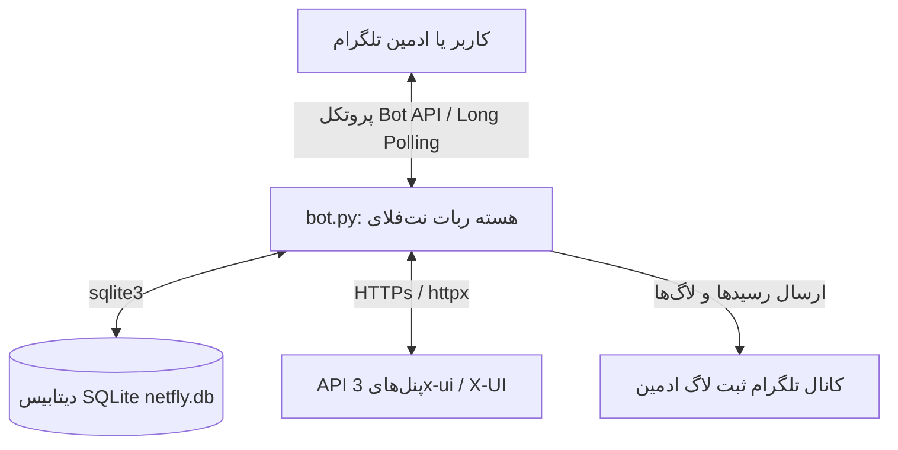
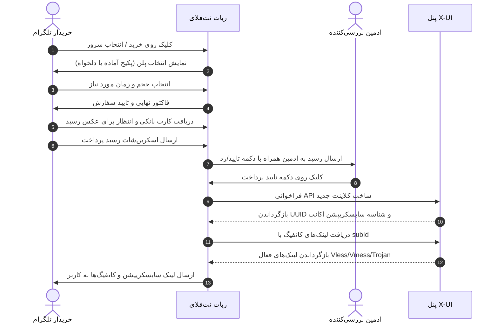

# نت‌فلای (NetFly) — ربات پیشرفته تلگرام برای فروش و مدیریت اشتراک VPN متصل به پنل‌های X-UI

**نت‌فلای (NetFly)** یک ربات تلگرامی پرسرعت، غنی و کاملاً فارسی‌سازی شده برای فروش، تحویل خودکار و مدیریت اشتراک‌های VPN است. این پروژه بر بستر فریم‌ورک‌های مدرن و ناهمگام پایتون ([aiogram 3.x](file:///c:/Users/Litebeet/Desktop/Netfly/requirements.txt#L1) و [httpx](file:///c:/Users/Litebeet/Desktop/Netfly/requirements.txt#L3)) توسعه یافته و با اتصال مستقیم به پنل‌های **X-UI / 3x-ui**، امکان تحویل خودکار کانفیگ‌ها، لینک‌های سابسکریپشن، استعلام زنده حجم مصرفی و مدیریت اکانت‌ها را برای کاربران و مدیران فراهم می‌سازد.

---

## 🗺️ معماری پروژه و جریان داده‌ها

نمودار زیر نشان می‌دهد که چگونه کاربر یا مدیر با ربات ارتباط برقرار کرده، اطلاعات در پایگاه داده SQLite ذخیره شده، درخواست‌ها به پنل‌های X-UI ارسال گردیده و در نهایت گزارش عملیات‌ها به کانال لاگ فرستاده می‌شود:



---

## 📂 ساختار فایل‌های پروژه

کد منبع ربات به صورت کاملاً ماژولار بخش‌بندی شده است:

*   **[bot.py](file:///c:/Users/Litebeet/Desktop/Netfly/bot.py)**: فایل اصلی و نقطه شروع ربات. عهده‌دار راه‌اندازی لاگر، بارگذاری تنظیمات، اتصال به دیتابیس SQLite، ثبت میدلورها و هندلرهای تلگرام، و شروع فرآیند دریافت پیام‌ها (Polling).
*   **[app/](file:///c:/Users/Litebeet/Desktop/Netfly/app)**
    *   **[config.py](file:///c:/Users/Litebeet/Desktop/Netfly/app/config.py)**: بارگذاری و اعتبارسنجی متغیرهای محیطی با استفاده از `dotenv` در کلاس [Settings](file:///c:/Users/Litebeet/Desktop/Netfly/app/config.py#L40).
    *   **[db.py](file:///c:/Users/Litebeet/Desktop/Netfly/app/db.py)**: کلاس پایگاه داده [Database](file:///c:/Users/Litebeet/Desktop/Netfly/app/db.py#L217) شامل مهاجرت‌ها (Migration) و تمام تراکنش‌های دیتابیس SQLite.
    *   **[xui.py](file:///c:/Users/Litebeet/Desktop/Netfly/app/xui.py)**: پیاده‌سازی کلاس [XuiClient](file:///c:/Users/Litebeet/Desktop/Netfly/app/xui.py#L280) جهت ارسال درخواست‌های ناهمگام به API پنل‌های X-UI.
    *   **[channel_gate.py](file:///c:/Users/Litebeet/Desktop/Netfly/app/channel_gate.py)**: پیاده‌سازی قفل کانال تلگرام و احراز هویت عضویت کاربران پیش از استفاده از ربات.
    *   **[pricing.py](file:///c:/Users/Litebeet/Desktop/Netfly/app/pricing.py)**: محاسبات مالی مربوط به تعرفه‌های پایه، حجم، زمان و کدهای تخفیف.
    *   **[logs.py](file:///c:/Users/Litebeet/Desktop/Netfly/app/logs.py)**: سیستم ثبت رویدادها ([NetFlyLogger](file:///c:/Users/Litebeet/Desktop/Netfly/app/logs.py#L166)) که لاگ تمام خریدهای موفق، خطاهای پنل، تغییرات دستی ادمین و تیکت‌ها را با قالب HTML به کانال لاگ تلگرام ادمین ارسال می‌کند.
    *   **[role_permissions.py](file:///c:/Users/Litebeet/Desktop/Netfly/app/role_permissions.py)** و **[admin_perms.py](file:///c:/Users/Litebeet/Desktop/Netfly/app/admin_perms.py)**: سیستم پیشرفته مدیریت نقش‌ها و ماتریس دسترسی ادمین‌ها و کارکنان ربات.
    *   **[texts.py](file:///c:/Users/Litebeet/Desktop/Netfly/app/texts.py)** و **[keyboards.py](file:///c:/Users/Litebeet/Desktop/Netfly/app/keyboards.py)**: متون فارسی ربات و دکمه‌های شیشه‌ای / کیبوردهای معمولی تلگرام.
    *   **[middlewares.py](file:///c:/Users/Litebeet/Desktop/Netfly/app/middlewares.py)**: میدلورهای اختصاصی ربات؛ شامل `UserMiddleware` (ثبت‌نام خودکار و بروزرسانی پروفایل کاربران در دیتابیس) و `ChannelJoinMiddleware` (اجبار به عضویت در کانال اسپانسر).
    *   **[handlers/](file:///c:/Users/Litebeet/Desktop/Netfly/app/handlers/)**: شامل هندلرهای پردازش پیام‌ها و دکمه‌های شیشه‌ای:
        *   **[start.py](file:///c:/Users/Litebeet/Desktop/Netfly/app/handlers/start.py)**: هندل فرمان `/start` و هدایت کاربران به منوی خرید و ادمین‌ها به پنل مدیریت.
        *   **[order.py](file:///c:/Users/Litebeet/Desktop/Netfly/app/handlers/order.py)**: فرآیند چندمرحله‌ای خرید کاربر (لوکیشن ➡️ حجم ➡️ زمان ➡️ پرداخت کارت به کارت ➡️ ارسال رسید).
        *   **[review.py](file:///c:/Users/Litebeet/Desktop/Netfly/app/handlers/review.py)**: صف مدیریت رسیدهای پرداخت توسط ادمین‌ها (تأیید و ساخت اکانت در پنل / رد رسید همراه با دلیل).
        *   **[my_services.py](file:///c:/Users/Litebeet/Desktop/Netfly/app/handlers/my_services.py)**: بخش «سرویس‌های من» شامل مشاهده مشخصات سرویس، استعلام زنده مصرف حجم، فعال/غیرفعال‌سازی، تغییر نام کانفیگ، تغییر کلید (UUID) و تمدید اشتراک.
        *   **[test_sub.py](file:///c:/Users/Litebeet/Desktop/Netfly/app/handlers/test_sub.py)**: فرآیند اهدای خودکار اشتراک تست رایگان و یک‌بار مصرف به کاربران.
        *   **[support.py](file:///c:/Users/Litebeet/Desktop/Netfly/app/handlers/support.py)**: سیستم ثبت تیکت پشتیبانی و پاسخ‌دهی ادمین به تیکت‌ها مستقیماً از داخل ربات.
        *   **[admin_panel.py](file:///c:/Users/Litebeet/Desktop/Netfly/app/handlers/admin_panel.py)**: کنترل‌پنل یکپارچه ادمین برای مدیریت سرورها، کاربران، تنظیمات مالی و آمار فروش.

---

## 🗄️ ساختار دیتابیس (جدول‌های SQLite)

پایگاه داده پروژه با SQLite پیاده‌سازی شده و از ارتباطات رابطه‌ای کلید خارجی بهره می‌برد. جدول‌های اصلی دیتابیس به شرح زیر هستند:

### ۱. جدول `users` (کاربران)
اطلاعات مربوط به تمام کاربرانی که ربات را استارت زده‌اند.
*   `user_id` (INTEGER - کلید اصلی): شناسه عددی تلگرام کاربر.
*   `username` ، `first_name` ، `last_name` ، `lang_code` (TEXT): مشخصات پروفایل تلگرام.
*   `created_at` (TEXT): تاریخ اولین تعامل با ربات.
*   `is_banned` (INTEGER): پرچم مسدودیت کاربر در ربات (0 یا 1).

### ۲. جدول `settings` (تنظیمات)
مخزن ذخیره‌سازی کلید-مقدار برای کانفیگ‌های داینامیک سیستم (شماره کارت، تعرفه‌های مالی، وضعیت اشتراک تست، آیدی کانال قفل و نقش‌های ادمین).
*   `key` (TEXT - کلید اصلی)
*   `value` (TEXT)

### ۳. جدول `locations` (لوکیشن‌ها / سرورها)
اطلاعات پنل‌های X-UI متصل به ربات.
*   `id` (INTEGER - کلید اصلی خودکار)
*   `name` (TEXT): نام نمایشی سرور (مثلاً آلمان، فنلاند).
*   `base_url` (TEXT): آدرس کامل پنل X-UI (همراه با پورت و مسیر).
*   `api_token` (TEXT): توکن احراز هویت Bearer برای اتصال به پنل.
*   `inbound_ids` (TEXT): لیست آرایه JSON از شناسه‌های inboundهای مجاز در پنل برای تخصیص اکانت.
*   `sub_url_template` (TEXT): فرمت قالب لینک سابسکریپشن پنل.
*   `price_base` ، `price_per_gb` ، `price_per_day` (INTEGER): قیمت‌گذاری اختصاصی سرور (در صورت خالی بودن، از تعرفه سراسری دیتابیس استفاده می‌شود).
*   `enabled` (INTEGER): وضعیت کلی سرور (فعال/غیرفعال).
*   `purchase_enabled` (INTEGER): امکان یا عدم امکان خرید اشتراک جدید از این سرور.
*   `is_test` (INTEGER): مشخص‌کننده سروری که برای ساخت اکانت‌های تست رایگان استفاده می‌شود.
*   `config_buttons` (TEXT): آرایه JSON از فیلترهای جغرافیایی کانفیگ‌ها در منوی کاربر.

### ۴. جدول `orders` (سفارش‌ها و اشتراک‌ها)
مهم‌ترین جدول سیستم که اطلاعات خریدها، وضعیت‌های پرداخت و مشخصات فنی اشتراک کاربر در پنل X-UI را نگهداری می‌کند.
*   `id` (INTEGER - کلید اصلی خودکار)
*   `user_id` (INTEGER): کلید خارجی متصل به جدول کاربران.
*   `location_id` (INTEGER): کلید خارجی متصل به جدول لوکیشن‌ها.
*   `location_name` (TEXT): نام لوکیشن در لحظه خرید (برای پایداری گزارشات در صورت حذف لوکیشن).
*   `volume_gb` ، `duration_days` ، `price` (INTEGER): مشخصات فنی سفارش ثبت شده و قیمت محاسبه شده.
*   `status` (TEXT): وضعیت سفارش در ماشین وضعیت ربات (`awaiting_payment` ، `awaiting_review` ، `approved` ، `declined` ، `provisioned` ، `failed` ، `completed_renewal`).
*   `screenshot_file_id` (TEXT): آیدی فایل عکس رسید ارسال شده توسط کاربر در سرور تلگرام.
*   `admin_id` (INTEGER): آیدی تلگرام ادمینی که رسید را بررسی کرده است.
*   `decline_reason` (TEXT): علت رد رسید در صورت انصراف یا نامعتبر بودن پرداخت.
*   `xui_email` (TEXT): ایمیل ثبت‌شده کلاینت در پنل (شناسه یکتا مانند `nf101` یا `nf101r1`).
*   `xui_sub_id` (TEXT): شناسه سابسکریپشن اکانت کاربر در پنل.
*   `xui_client_uuid` (TEXT): کلید UUID کانفیگ کاربر.
*   `sub_links` (TEXT): آرایه JSON از لینک‌های کانفیگ استخراج‌شده.
*   `nickname` (TEXT): نام مستعار دلخواهی که کاربر روی اشتراک خود می‌گذارد.
*   `is_test` (INTEGER): مشخص‌کننده اینکه آیا سفارش مربوط به اشتراک تست رایگان است یا خیر.
*   `renew_of_order_id` (INTEGER): کلید خارجی خودارجاع برای متصل کردن سفارش‌های تمدید به سفارش اصلی خریده شده.

### ۵. جدول `tickets` (تیکت‌های پشتیبانی)
*   `id` (INTEGER - کلید اصلی خودکار)
*   `user_id` (INTEGER): کلید خارجی متصل به جدول کاربران.
*   `message` (TEXT): متن پیام تیکت پشتیبانی.
*   `status` (TEXT): وضعیت تیکت (`open` یا `closed`).
*   `created_at` (TEXT)

### ۶. جدول `service_packages` (پکیج‌های آماده فروش)
*   `id` (INTEGER - کلید اصلی خودکار)
*   `location_id` (INTEGER): کلید خارجی متصل به لوکیشن.
*   `volume_gb` ، `duration_days` ، `price` (INTEGER): مقادیر حجمی، زمانی و قیمت پکیج.
*   `enabled` (INTEGER): وضعیت پکیج.

---

## 👥 مدیریت نقش‌ها و سطوح دسترسی ادمین‌ها

ربات نت‌فلای از سیستم پیشرفته کنترل دسترسی چندسطحی برای کارکنان پشتیبانی و ادمین‌ها بهره می‌برد. اولین آیدی ست‌شده در بخش `ADMIN_IDS` در متغیرهای محیطی به عنوان **مالک اصلی (Owner)** شناخته شده و دسترسی کامل به کل ربات دارد. مالک می‌تواند دسترسی‌ها و نقش سایر ادمین‌ها را از داخل ربات یا دیتابیس ویرایش کند.

نقش‌های پیش‌فرض و مجوزهای آن‌ها به شرح زیر است:

| کلید مجوز | شرح مجوز | مالک | مدیر (Manager) | تاییدکننده (Reviewer) | پشتیبان (Support) | ناظر (Viewer) |
| :--- | :--- | :---: | :---: | :---: | :---: | :---: |
| `panel` | ورود به پنل ادمین ربات با دستور `/admin` | ✅ | ✅ | ✅ | ✅ | ✅ |
| `dashboard` | مشاهده آمارهای فروش، تعداد کاربران و نمودارها | ✅ | ✅ | ✅ | ✅ | ✅ |
| `orders_review` | بررسی و تایید/رد رسیدهای واریزی کاربران | ✅ | ✅ | ✅ | ✅ | ❌ |
| `orders_manage` | جستجو، تغییر نام، ویرایش و حذف اکانت‌های کاربران | ✅ | ✅ | ✅ | ❌ | ❌ |
| `users` | مشاهده لیست کاربران تلگرام و مسدود/آزاد کردن آن‌ها | ✅ | ✅ | ❌ | ✅ | ✅ |
| `customers` | مشاهده مشخصات مشتریان و سابقه سفارش‌های پرداخت شده | ✅ | ✅ | ✅ | ✅ | ✅ |
| `settings` | تغییر کارت بانکی ربات، تعرفه‌ها و فعال‌سازی تست رایگان | ✅ | ✅ | ❌ | ❌ | ❌ |
| `services` | مدیریت پکیج‌های آماده و سوئیچ بین حالت انتخابی/فرمول | ✅ | ✅ | ❌ | ❌ | ❌ |
| `offer` | تعریف و خاموش کردن جشنواره‌های تخفیف سراسری | ✅ | ✅ | ❌ | ❌ | ❌ |
| `locations` | افزودن، ویرایش و حذف سرورها و اینباندها | ✅ | ✅ | ❌ | ❌ | ❌ |
| `tools_broadcast`| ارسال پیام همگانی (متن، عکس، فایل) به کل کاربران | ✅ | ✅ | ❌ | ❌ | ❌ |
| `tools_sync` | همگام‌سازی و پاکسازی اکانت‌های منقضی شده با پنل | ✅ | ✅ | ❌ | ❌ | ❌ |
| `tools_misc` | ابزارهای متفرقه مانند بهینه‌سازی دیتابیس و تست سلامت | ✅ | ✅ | ❌ | ❌ | ❌ |
| `manage_admins` | عزل، نصب و تغییر سطح دسترسی سایر کارکنان ربات | ✅ | ❌ | ❌ | ❌ | ❌ |

---

## 🔄 جزئیات فرآیندهای حیاتی ربات

### ۱. فرآیند خرید و تحویل خودکار اکانت



1.  **انتخاب پلن**: کاربر سرور مورد نظر خود را انتخاب می‌کند. در حالت **فروش پکیجی**، پکیج‌های ثابت نمایش داده شده و در حالت **خرید دلخواه**، کاربر حجم و زمان را به انتخاب خود وارد می‌کند.
2.  **پیش‌فاکتور**: ربات فاکتور نهایی را بر اساس نرخ لوکیشن یا تعرفه سراسری محاسبه کرده و پس از تأیید خریدار، شماره کارت و دارنده حساب را نمایش می‌دهد و وضعیت سفارش را به `awaiting_payment` تغییر می‌دهد.
3.  **ارسال رسید**: کاربر تصویر فیش واریزی را ارسال می‌کند. ربات سفارش را به `awaiting_review` تغییر داده و رسید پرداخت را فوراً به چت یا کانال بررسی ادمین‌ها فوروارد می‌کند.
4.  **تأیید پرداخت**: ادمین پس از چک کردن حساب بانکی، دکمه **تایید (Accept)** را می‌زند. ربات به صورت ناهمگام با پنل X-UI ارتباط برقرار کرده، اکانت را با مشخصات سفارش ساخته، لینک‌های سابسکریپشن را استخراج نموده و تحویل خریدار می‌دهد.

---

### ۲. فرآیند تمدید اشتراک فعال
در ربات نت‌فلای، تمدید اکانت بدون ساخت کلاینت جدید یا نیاز به تغییر کانفیگ کاربر انجام می‌شود:
1.  کاربر در بخش **سرویس‌های من** روی دکمه تمدید کلیک کرده و تعرفه جدید را انتخاب می‌کند.
2.  پس از واریز پول و تأیید ادمین، ربات با صدا زدن API پنل X-UI کلاینت فعلی را ویرایش می‌کند:
    *   **حجم**: حجم خریداری‌شده به حجم باقی‌مانده اشتراک فعلی اضافه می‌شود (`حجم جدید = حجم باقی‌مانده + حجم خریداری شده`).
    *   **تاریخ انقضا**: مدت زمان جدید تمدید به تاریخ انقضای اکانت اضافه می‌شود. (اگر اشتراک منقضی شده باشد، زمان از تاریخ روز تمدید و در غیر این صورت به انتهای تاریخ انقضای آینده اکانت اضافه می‌گردد).
3.  سفارش تمدید به صورت آرشیو در جدول سفارش‌ها ثبت شده و مشخصات اکانت اصلی بروزرسانی می‌گردد.

---

### ۳. پنل کاربری «سرویس‌های من»
کاربران می‌توانند کانفیگ‌های فعال خود را مستقیماً مدیریت کنند:
*   **🔄 بروزرسانی مصرف**: استعلام زنده ترافیک مصرف‌شده (آپلود/دانلود) و تاریخ انقضا به شمسی و میلادی.
*   **🟢/🔴 فعال یا غیرفعال‌سازی**: خاموش/روشن کردن موقت اتصال اکانت در پنل X-UI.
*   **✏️ تغییر نام کانفیگ**: ویرایش شناسه ایمیل اکانت در پنل به مقدار دلخواه (مانند `nf101-phone`) جهت مدیریت بهتر دستگاه‌ها.
*   **🔄 تغییر کلید (UUID)**: فرآیندی که اکانت فعلی کاربر را در پنل حذف کرده و فوراً با همان میزان حجم و انقضا، یک اکانت با UUID و سابسکریپشن آیدی جدید می‌سازد. این ابزار برای دور زدن فیلترینگ یا لغو دسترسی دستگاه‌های غیرمجاز کاربرد دارد.
*   **🎛️ فیلترهای جغرافیایی کانفیگ**: اگر ادمین دکمه‌های فیلتر را برای سرور تنظیم کرده باشد، کاربر می‌تواند با کلیک روی کشورها (مثلاً آلمان، ایران)، کانفیگ‌های مربوط به آن کشورها را به صورت فیلترشده استخراج کند.

---

## 🔒 قفل عضویت اجباری کانفل کانال تلگرام (Join Gate)

جهت جذب اعضا، استفاده از امکانات ربات مشروط به عضویت در کانال تلگرام است:
1.  **میدلور کنترل عضویت**: میدلور `ChannelJoinMiddleware` تمامی تعاملات کاربران معمولی را مسدود کرده و عضویت در کانال را از تلگرام استعلام می‌گیرد.
2.  **حافظه موقت (Cache)**: وضعیت ادمین بودن ربات در کانال و وضعیت عضویت کاربر به صورت موقت کش می‌شود تا سرعت پاسخ‌دهی ربات افت نکرده و با محدودیت نرخ درخواست تلگرام مواجه نشود.
3.  **پیام هدایت**: در صورت عدم عضویت، ربات پیام هشدار همراه با لینک عضویت و دکمه شیشه‌ای «تایید عضویت» ارسال می‌کند.
4.  **هشدار خرابی قفل**: در صورتی که ربات از کانال حذف شود یا ادمین نباشد، خطایی در پس‌زمینه ثبت شده و ادمین‌های ربات پیام هشدار دریافت می‌کنند.

---

## 💰 قیمت‌گذاری پویا و سیستم تخفیف‌ها

فرمول محاسبه قیمت در حالت خرید دلخواه به صورت زیر است:
$$\text{قیمت کل (تومان)} = \text{قیمت پایه} + (\text{حجم به گیگابایت} \times \text{قیمت هر گیگ}) + (\text{مدت به روز} \times \text{قیمت روزانه})$$

مدیران می‌توانند تعرفه‌های پایه، گیگابایتی و روزانه را برای هر سرور به صورت اختصاصی تنظیم نمایند.

### کمپین‌های تخفیف سراسری
ادمین می‌تواند جشنواره‌های تخفیف را فعال کند:
*   **درصدی (`percent`)**: اعمال تخفیف درصدی روی فاکتور نهایی (مثلاً ۲۰ درصد تخفیف روی کل فاکتور).
*   **مبلغ ثابت کسر شونده (`amount`)**: کسر مبلغ مشخص (مثلاً ۵۰,۰۰۰ تومان) از فاکتور نهایی.
*   **قیمت مقطوع (`fixed`)**: چشم‌پوشی از فرمول و پکیج‌ها و اعمال یک قیمت ثابت برای تمامی سفارش‌ها.

---

## 🔌 جزئیات فنی وب‌سرویس X-UI (API Client)

کلاس [XuiClient](file:///c:/Users/Litebeet/Desktop/Netfly/app/xui.py#L280) وظیفه مدیریت پروتکل‌های HTTP و کار با پنل‌های X-UI را دارد. ویژگی‌های فنی این کلاس شامل موارد زیر است:

1.  **پردازش مسیرهای پنل (Base URL)**: این ماژول آدرس پایه پنل را بدون وابستگی به مکانیزم الحاق مسیر کتابخانه‌های پیش‌فرض پردازش می‌کند تا در صورتی که پنل پشت یک ساب‌پات (مانند `https://site.com/mysecretpath/`) مخفی شده باشد، مسیر مخفی پنل در درخواست‌ها حذف نشود.
2.  **استخراج هویت کلاینت**: به دلیل تفاوت در خروجی آپدیت‌ها در فورک‌های مختلف 3x-ui، تابع `resolve_client_identity` ابتدا تلاش می‌کند تا `subId` و `uuid` را از پاسخ ساخت کلاینت خوانده، در غیر این صورت لیست کل کلاینت‌ها را اسکن کرده و در نهایت متد get کلاینت را به عنوان آخرین راهکار فراخوانی کند.
3.  **مکانیزم تخصیص مجدد ایمیل (Regen)**: در صورت بازسازی اشتراک، ربات برای جلوگیری از بروز خطای تکراری بودن شناسه در پنل، کلاینت قبلی را حذف و شناسه جدید را با افزودن پسوند تولید می‌کند (مانند `nf101` ➡️ `nf101r1` ➡️ `nf101r2`).

---

## 📊 ثبت گزارشات و لاگ‌های ادمین (Audit Trail)

ماژول [NetFlyLogger](file:///c:/Users/Litebeet/Desktop/Netfly/app/logs.py#L166) مسئولیت ارسال لاگ‌های نظارتی به کانال ادمین را دارد:
*   `log_order_awaiting_payment`: ثبت لاگ رزرو فاکتور توسط کاربر.
*   `log_receipt_uploaded`: فوروارد فیش واریزی ارسال شده به کانال لاگ.
*   `log_order_accepted` و `log_order_provision_failed`: ثبت نتایج فرآیند تأیید فیش و ساخت اکانت در پنل.
*   `log_order_cancelled`: ثبت لغو پیش‌فاکتور توسط کاربر.
*   `log_test_service`: گزارش دریافت اشتراک تست.
*   `log_support_ticket`: کپی کردن تیکت‌های پشتیبانی در کانال لاگ ادمین.
*   `log_admin_order_action`: ثبت لاگ فعالیت‌های مدیریتی ادمین‌ها (حذف اکانت، ویرایش حجم، همگام‌سازی پنل).
*   `log_user_ban` و `log_broadcast_done`: گزارش مسدودسازی‌ها و ارسال پیام‌های همگانی.

---

## 🛠️ اسکریپت‌های مهاجرت و ابزارهای انتقال

پروژه دارای دو اسکریپت مدیریت و نگهداری سرور است:

۱.  **[migrate_to_multi.py](file:///c:/Users/Litebeet/Desktop/Netfly/migrate_to_multi.py)**: ابزاری برای انتقال دسته‌جمعی یا تکی کاربران از یک سرور به سرور دیگر.
    *   **اگر هر دو سرور در یک پنل باشند**: فقط اینباندهای کلاینت‌ها آپدیت شده و لینک‌های سابسکریپشن جدید جایگزین می‌گردند.
    *   **اگر سرورها در پنل‌های متفاوتی باشند**: ابتدا میزان ترافیک مصرفی و انقضای کاربر از پنل مبدا استعلام گرفته شده، اشتراک در مبدا حذف می‌گردد و بلافاصله در پنل مقصد با همان مشخصات فنی و باقی‌مانده حجم و زمان بازسازی شده و دیتابیس بروزرسانی می‌شود.
۲.  **[app/migrate_clients.py](file:///c:/Users/Litebeet/Desktop/Netfly/app/migrate_clients.py)**: بررسی دیتابیس و انتقال کاربران قدیمی تک‌لوکیشن به پنل جدید و همگام‌سازی مشخصات اتصال آن‌ها.

---

## 🚀 راهنمای نصب و راه‌اندازی ربات

### پیش‌نیازها
*   پایتون نسخه ۳.۱۰ یا بالاتر
*   پنل 3x-ui (مانند نسخه علیرضا یا ام‌اچ‌سنایی) با API فعال.
*   توکن ربات تلگرام دریافت شده از [@BotFather](https://t.me/BotFather).

### نصب دستی (روی هاست / سرور)
1.  پروژه را کلون کرده و وارد دایرکتوری آن شوید:
    ```bash
    git clone https://github.com/itsjesuz/Netfly.git
    cd Netfly
    ```
2.  محیط مجازی پایتون را ساخته و فعال کنید:
    ```bash
    python -m venv .venv
    # فعال‌سازی در ویندوز پاورشل:
    .\.venv\Scripts\Activate.ps1
    # فعال‌سازی در مک / لینوکس:
    source .venv/bin/activate
    ```
3.  پکیج‌های پیش‌نیاز را نصب کنید:
    ```bash
    pip install -r requirements.txt
    ```
4.  فایل نمونه تنظیمات `.env.example` را کپی کرده و نام آن را به `.env` تغییر دهید و مقادیر مربوطه را پر کنید:
    ```ini
    BOT_TOKEN=توکن_ربات_شما
    ADMIN_IDS=آیدی_تلگرام_مالک_اصلی,آیدی_تلگرام_ادمین_دوم
    DB_PATH=netfly.db
    REQUIRED_CHANNEL_ID=آیدی_عددی_کانال_قفل_تلگرام_همراه_با_منفی_۱۰۰
    ```
5.  ربات را اجرا کنید:
    ```bash
    python bot.py
    ```

### 🐳 اجرا با داکر (Docker Deployment)
پروژه شامل [Dockerfile](file:///c:/Users/Litebeet/Desktop/Netfly/Dockerfile) و [docker-compose.yml](file:///c:/Users/Litebeet/Desktop/Netfly/docker-compose.yml) است. دیتابیس ربات در پوشه `./data` هاست نگهداری می‌شود تا با ریستارت یا آپدیت داکر، اطلاعات حذف نشوند.

1.  فایل `.env` را در کنار پوشه پروژه ایجاد و کانفیگ کنید.
2.  دستور زیر را برای ساخت و اجرای ربات در پس‌زمینه بنویسید:
    ```bash
    docker-compose up -d --build
    ```
